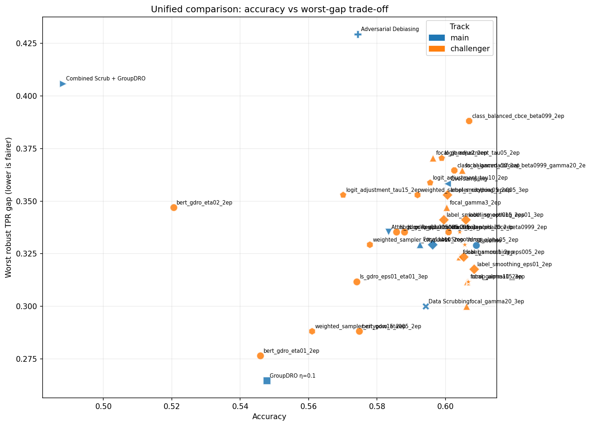

# Improving Fairness in AI-Powered Resume Screening

Research code for an **interpretable, fairness-aware BERT resume classifier** (9 IT job supercategories, Russian HeadHunter data). The project audits geographic proxy bias with **Integrated Gradients**, compares **six debiasing methods**, and stress-tests models with **city-swap counterfactuals** and English transfer evaluation.

**Published in** [*Mathematics & AI*](https://doi.org/10.66693/mathai.1017) (2026).

<p align="center">
  <a href="figures/unified_comparison/fig01_accuracy_vs_worst_gap.png">
    
  </a>
  <br>
  <em>Accuracy–fairness trade-off across debiasing methods (see <code>71_unified_models_comparison.ipynb</code>).</em>
</p>

## Publication

> **Agapova, N. A.; Lukmanov, R. A.** Improving Fairness in AI-Powered Recrutiment: An Interpretable Resume Screening System. *Mathematics & AI* **2026**, *1*(2), 14. [https://doi.org/10.66693/mathai.1017](https://doi.org/10.66693/mathai.1017)

## Highlights

- **Audit-first workflow** — Integrated Gradients reveal systematic reliance on city, gender, and age proxies that should not drive hiring decisions.
- **Six debiasing strategies** — in-processing (GroupDRO, focal loss, label smoothing, adversarial debiasing) and attribution-guided methods (data scrubbing, attention regularization).
- **Robustness checks** — city-swap counterfactuals across 41 city groups; English transfer evaluation on aligned résumé slices.
- **Unified comparison** — accuracy, macro F1, and worst-case TPR gaps for all models in one table ([CSV](notebooks/results/unified_comparison/c71_unified_models_table.csv)).
- **Prior work** — extends [xai-resume-bias](https://github.com/natagapova/xai-resume-bias), an earlier Integrated Gradients study of resume classification bias.

## Repository layout

| Path | Contents |
|------|----------|
| [`notebooks/`](notebooks/) | Training, debiasing, fairness analysis, and figure-generation notebooks |
| [`figures/`](figures/) | Paper- and slide-ready plots ([`paper_figures/`](figures/paper_figures/), [`unified_comparison/`](figures/unified_comparison/)) |
| [`notebooks/results/`](notebooks/results/) | Exported metrics, summary tables, and TeX fragments |
| [`thesis/thesis.pdf`](thesis/thesis.pdf) | Full thesis write-up (VKR) |

There is no separate `src/` package — experiment logic lives in notebooks (typical for thesis research artifacts).

## Key artifacts

| Artifact | Path |
|----------|------|
| Unified model comparison | [`notebooks/results/unified_comparison/c71_unified_models_table.csv`](notebooks/results/unified_comparison/c71_unified_models_table.csv) |
| Paper figures | [`figures/paper_figures/`](figures/paper_figures/) |
| Integrated Gradients analysis | [`notebooks/41_integrated_gradients.ipynb`](notebooks/41_integrated_gradients.ipynb) |
| Main BERT training | [`notebooks/24_finetuned_bert.ipynb`](notebooks/24_finetuned_bert.ipynb) |
| City-swap evaluation | [`notebooks/70_city_swap_batch_eval.ipynb`](notebooks/70_city_swap_batch_eval.ipynb) |

For a full notebook index, gitignore rules, and regeneration notes, see **[REPRODUCIBILITY.md](REPRODUCIBILITY.md)**.

## Getting started

```bash
git clone https://github.com/natagapova/resume-screening.git
cd resume-screening
python -m venv .venv && source .venv/bin/activate
pip install -r requirements.txt
jupyter lab
```

1. Place processed data under `data/` (not included — private HeadHunter-derived dataset).
2. Train or copy model checkpoints locally (`notebooks/models/` is gitignored).
3. Suggested entry points: `24_finetuned_bert.ipynb` → `40_fairness_and_error_analysis.ipynb` → `71_unified_models_comparison.ipynb`.

Summary metrics and figures in the repo can be inspected without retraining. Row-level prediction CSVs and model weights are excluded from git; see [REPRODUCIBILITY.md](REPRODUCIBILITY.md) for how to regenerate them.

## License

MIT — see [LICENSE](LICENSE).
